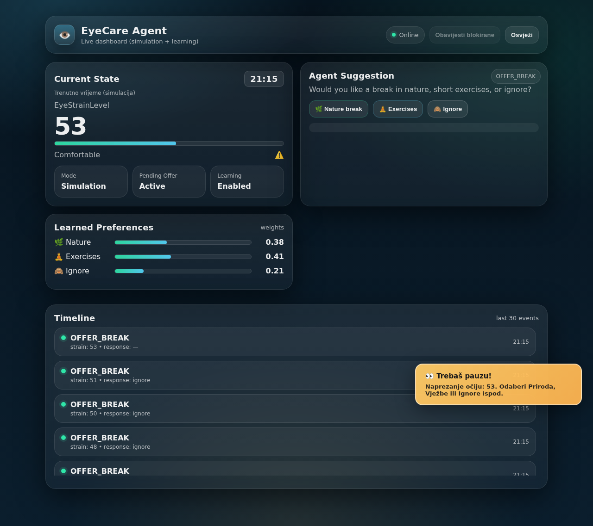

# EyeCare Agent – Adaptive AI Agent for Eye Strain

An intelligent agent that tracks simulated eye strain during computer work and suggests breaks at the right moment. It follows the **Sense → Think → Act → Learn** cycle and **learns from user feedback**. If the user often ignores suggestions at a certain hour, the agent bothers them less at that hour; if they accept, it intervenes earlier.

University project at the Faculty of Information Technologies, Džemal Bijedić University of Mostar.


*Dashboard with sample data*

## How it works

The agent runs in a simulation loop. One tick equals 5 minutes of simulated time and runs every 10 seconds in real time.

1. **Sense:** reads the current context, including active work time, whether the user is on a break, the hour of the day, and lighting (good or poor).
2. **Think:** updates the eye strain level (0–100) and decides on an action:
   - Strain increases by +1 for every 10 minutes of work, +1 in poor lighting and +2 at night (21:00–06:00).
   - Below the "no work" threshold, the action is `NO_WORK` (no intervention).
   - Between the thresholds, the action is `OFFER_BREAK`, offering a nature break, short exercises or ignore.
   - At 70 or above, the action is `STRONG_INTERVENTION`, which recommends only eye exercises.
3. **Act:** shows the suggestion on the dashboard as an in-page notification with buttons.
4. **Learn:** updates the agent based on the user's choice:
   - It adjusts **preference weights** for nature, exercises and ignore.
   - It keeps **per-hour statistics** of accepted vs. ignored suggestions.
   - It adapts **decision thresholds**. Ignoring raises them (fewer interruptions), while accepting lowers them (earlier help). Hours with frequent ignores get an extra threshold offset.
   - It **saves learned parameters** to `agent/agent-state.json`, so learning survives a restart.

**Break and cooldown:** after the user accepts a break (nature −25 strain, exercises −30 strain), the agent stays quiet for a 15-minute break and a 30-minute cooldown. If the user doesn't respond within 20 seconds, the suggestion counts as ignored.

## Architecture

```
┌──────────────────────┐   POST /api/update    ┌──────────────┐   GET /api/state    ┌──────────────┐
│  Agent layer         │ ────────────────────► │   Backend    │ ◄────────────────── │  Dashboard   │
│  SimulationRunner +  │                       │  (Express,   │                     │  (HTML/JS)   │
│  EyeCareAgent        │ ◄──────────────────── │   thin API)  │ ◄────────────────── │              │
└──────────────────────┘ GET /api/consume-     └──────────────┘   POST /api/respond └──────────────┘
                          response
```

- **`agent/EyeCareAgent.js`:** the agent itself (sense, think, act, learn), adaptive thresholds and state persistence
- **`agent/SimulationRunner.js`:** the tick loop, simulated time and lighting, waiting for the user's real response, break and cooldown logic, and sending state to the backend
- **`backend/server.js`:** a thin Express API with no decision logic; it only passes state and user responses between the agent and the dashboard, and it starts the runner automatically
- **`frontend/index.html`:** the live dashboard, showing current strain, the agent's suggestion, learned preferences and a timeline of the last 30 events

### API

| Method | Endpoint | Description |
|---|---|---|
| `POST` | `/api/update` | Runner sends a state snapshot |
| `GET` | `/api/state` | Dashboard reads the current state |
| `POST` | `/api/respond` | Dashboard sends the user's choice |
| `GET` | `/api/consume-response` | Runner picks up (and clears) the user's choice |

## Technologies

`JavaScript` · `Node.js` · `Express` · `HTML` · `CSS`

## How to run

Requirements: [Node.js](https://nodejs.org/) 18 or newer.

```bash
cd backend
npm install
npm start
```

Then open **http://localhost:4000/** in a browser. The backend starts the agent automatically. On Windows, you can also just double-click `START_BACKEND.bat` (after running `npm install` once).

## Project structure

```
eyecare-ai-agent/
├── agent/
│   ├── EyeCareAgent.js       # Agent: sense, think, act, learn
│   └── SimulationRunner.js   # Simulation loop and communication with backend
├── backend/
│   └── server.js             # Express API + serves the dashboard
├── frontend/
│   └── index.html            # Live dashboard
├── docs/
│   └── improvements.md       # Description of project improvements (Bosnian)
├── START_BACKEND.bat         # Starts backend + agent (Windows)
└── START_RUNNER.bat          # Starts only the agent (Windows)
```

## Author

Ajla Stranjak
